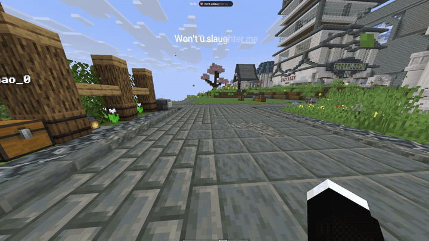
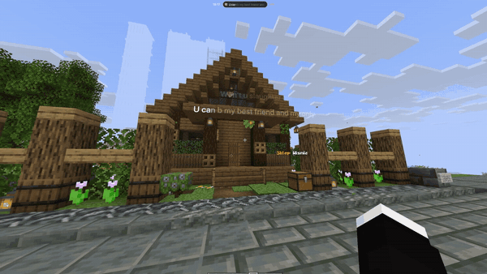
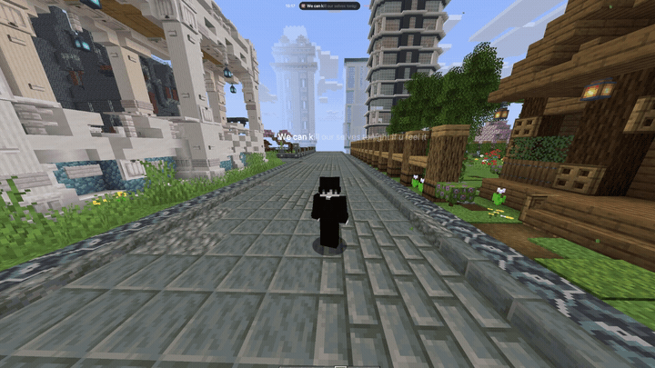
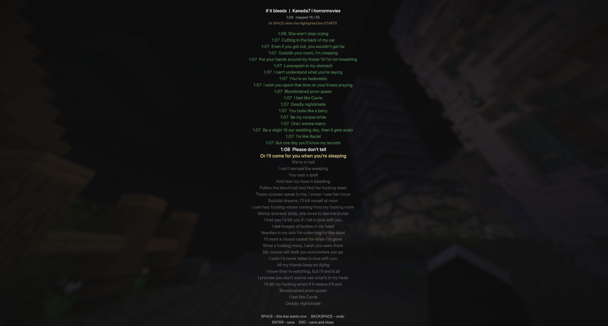
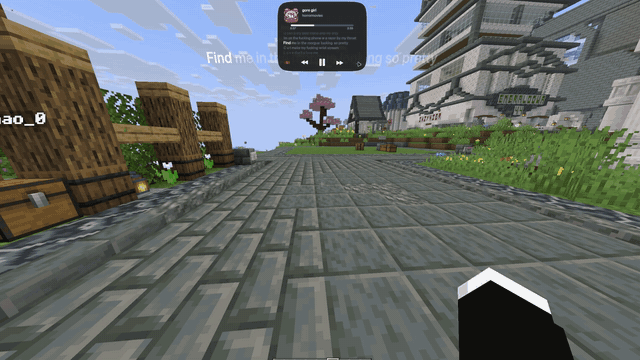

<div align="center">


# Song Island

[](https://minecraft.net)
[](https://fabricmc.net)
[](LICENSE)

</div>

### Now playing

Title, artist and lyrics

<div align="center">

</div>

### Text in 3d

3D text with the song lyrics in the world!

<div align="center">


</div>

### Manual Map Music

Song has no synced lyrics? No problem!

<div align="center">

</div>

### Drag

Put the island anywhere on your screen

<div align="center">

</div>

### Supported

**Players** - anything Windows sees as media:

- Spotify
- YouTube Music
- YouTube and other browser tabs (Chrome, Edge)
- SoundCloud

**Lyrics Libs**

1. Your own mappings
2. [LRCLIB](https://lrclib.net)
3. [NetEase](https://music.163.com)

### Config files

All config files: ``%APPDATA% > .minecraft > config > song-island``

(or if you use custom luncher ``<luncher patch/profile> > config > song-island``) ;)

### Settings

Open chat, click the island, then `...`.

| Option | What it does |
| --- | --- |
| Lyric delay | Delays lyrics for this song |
| Manual Map Music | Opens the mapping screen |
| [BETA] Text in 3d | Lyrics in the world |
| Hide bossbar | Hides boss bars |
| Drag | Move the island |

### Requirements

- Minecraft 1.21.11
- Fabric
- Fabric API
- Windows

### Building

```bash
./gradlew build
```

### License

AGPL-3.0. Uses [MediaPlayerInfo](https://github.com/Redstonecrafter0/MediaPlayerInfo) (AGPL-3.0)
and [JNA](https://github.com/java-native-access/jna) (Apache-2.0 / LGPL-2.1)
